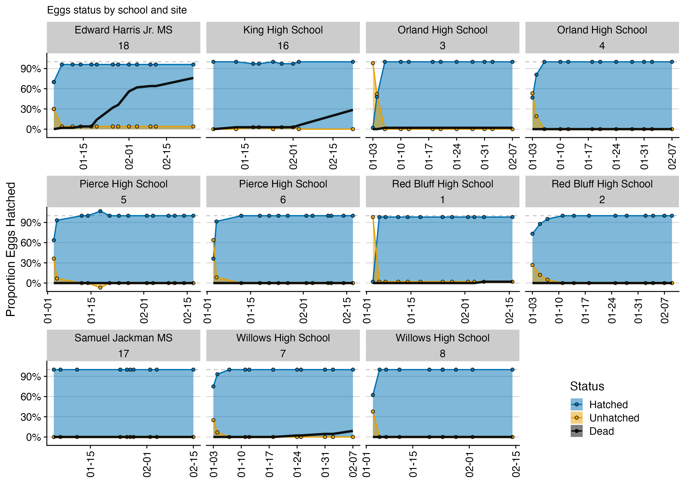
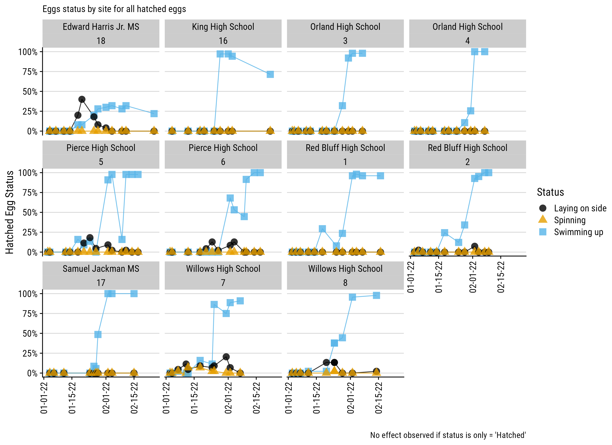
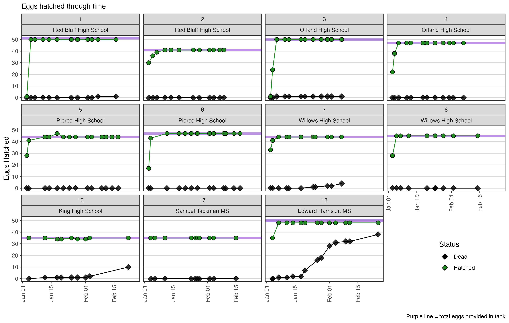

# Youth Monitoring of Salmon Thiamine

*A citizen science project to track the impacts of potential thiamine (Vitamin B1) deficiency (which is an essential building block for all life) through youth classrooms. Data will be reported from each classroom weekly as students monitor how salmon eggs in tanks hatch (or not) and grow.*

Thiamine Deficiency Complex (TDC) was first documented in California’s salmon in 2020. Fish hatchery staff noticed offspring swimming in circles and dying at elevated rates.
They traced the condition to a deficiency of thiamine, or Vitamin B1, passed on from the returning adults to their offspring.
Impacts to naturally spawning populations remain the greatest unknown and could be an unrecognized factor affecting harvest opportunities and impede salmon recovery.

Researchers at the UC Davis Center for Watershed Sciences and the National Oceanic and Atmospheric Administration (NOAA), together with the Department of Fish and Wildlife, are developing an Observation Protocol as part of the Salmon in the Classroom Program to help gather observation data of salmon during these critical stages of the lifecycle. These data will support the efforts of the broad coalition of scientists working on figuring out the TDC puzzle. By submitting data and participating in this project, you are supporting not only the data gathering for these programs, but also the development of further research protocols.

More information about this project and related work can be found at:

 - [**NOAA Fisheries Southwest Science Center**](https://www.fisheries.noaa.gov/west-coast/science-data/monitoring-thiamine-deficiency-california-salmon)

### The Data

Raw data will be collected via a google form, downloaded and saved, and then cleaned and summarized before being posted in the [`data_clean`](data_clean/) folder in this repository, with the date the data were most recently updated.

A template of the type of data that will be collected from each tank can be seen here: [`documents`](documents/thiamine_salmon_egg_tracking_template.pdf).

### Visualization & Figures

Additionally, a few summary plots of the data will be updated each week, and saved in the [`figures`](figures/) folder.

### CURRENT UPDATE! 

For a current snapshot of what things look like, see below! Again, these can be found [here](figures/) and called `summary_plots_updated_YYYY-MM-DD.png`  if you want to download a copy. 

__*updated 2021-03-07*__

Stay tuned for a summary/reveal!

### Open Source and Accessible

All the [`code`](code/) and figures posted here can be used or reused, with credit. Code is written using the freely open source [**R software**](https://cran.r-project.org) (`v.4.1.2`) and the [**RStudio IDE**](https://www.rstudio.com/products/rstudio/download/).

